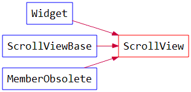

ScrollView
==============

*ScrollView*\ 封装了滚动区域的基本功能，继承关系如下:

*ScrollView*\ 的皮肤中至少需要三个控件，类型和名字如下::

	type="Widget" name="Client" // 显示区域
	type="ScrollBar" name="VScroll" // 垂直滚动条
	type="ScrollBar" name="HScroll" // 水平滚动条

*ScrollView*\ 中的\ **mRealClient**\ 就是所谓的\ **Canvas**\ ，在LayoutEditor中为ScrollView添加的子控件会成为\ **mRealClient**\ 的子控件。

*ScrollView*\ 响应以下事件::

    //用滚轮移动mRealClient
    mRealClient->eventMouseWheel

    //拖拽mRealClient
    mRealClient->eventMouseDrag
    mRealClient->eventMouseButtonPressed
    mRealClient->eventMouseButtonReleased

    //响应滚动条的位置变化
    mHScroll->eventScrollChangePosition
    mVScroll->eventScrollChangePosition